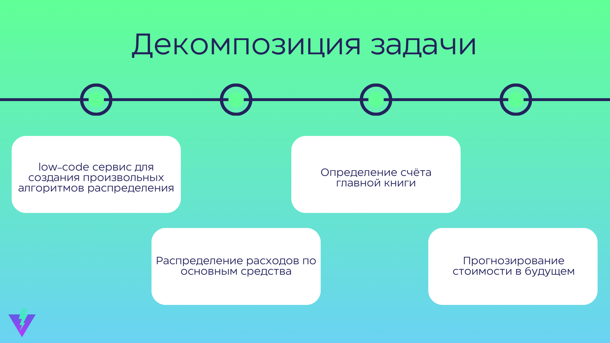
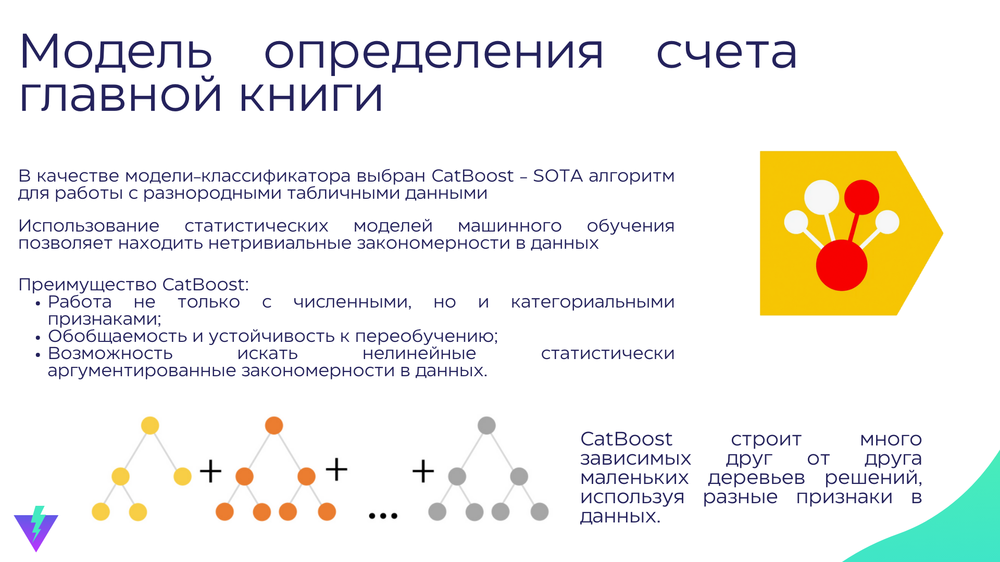

# [РаспределяйAI](https://xn--80aicbulygci4n.xn--p1ai)

[Основная информация](#основная-информация)

[Документация к core алгоритмам (python)](#документация-к-core-модулям)

[Примеры кода для запуска/обучения core-алгоритмов](#примеры-кода-для-запуска-core-алгоритмов)

## Основная информация
Приложение развернуто на наших мощностях для удобства демонстрации на домене **[распределяй.рф](https://xn--80aicbulygci4n.xn--p1ai)**.

**Инструкция по запуску сервисов** описана в **[quick-start.md](https://github.com/talkiiing-team/zakupai/blob/main/docs/quick-start.md)**.

Пользовательская документация доступна: **[здесь](https://evergreen-scarer-984.notion.site/f960dc52059049dea0c9f63e7ee0e761?pvs=4)**

Вся документация к модулям платформы расположена в **[docs](https://github.com/talkiiing-team/zakupai/blob/main/docs/)**.
Для навигации по ней используйте текущую страницу

## Документация к core-модулям

------------

### Модуль предобработки данных
**Документация к модулю**: **[merge_contracts.md](https://github.com/talkiiing-team/zakupai/blob/main/docs/merge_contracts.md)**.

**Код модуля**: **[merge_contracts.py](https://github.com/talkiiing-team/zakupai/tree/main/services/api/ml/lib/merge_contracts.py)**.

**Описание модуля**: реализует начальную предобработку данных - генерирует признаки в разрезе "основное средство-здание-договор-счет"

-----------

### Модуль запуска алгоритма распределения
**Документация модуля:** **[get_distribution_utils.md](https://github.com/talkiiing-team/zakupai/blob/main/docs/get_distribution_utils.md)**.

**Код модуля**: **[get_distribution_utils.py](https://github.com/talkiiing-team/zakupai/tree/main/services/api/ml/lib/get_distribution_utils.py)**.

**Описание модуля**: предподсчитывает необходимые данные и запускает обход по графу модуля all_blocks для всех основных средств

------

### Модуль с кодом обработки графа
**Документация модуля:** **[all_blocks.md](https://github.com/talkiiing-team/zakupai/blob/main/docs/all_blocks.md)**.

**Код модуля**: **[all_blocks.py](https://github.com/talkiiing-team/zakupai/tree/main/services/api/ml/lib/all_blocks.py)**.

**Описание модуля**: Реализует проход по графу-алгоритма, созданному пользователем и расчет метрики, нужной для распределения. Через этот модуль можно увеличивать функционал платформы - создавать новые блоки, обработчики связей.
Базовые классы графов и блоков при этом остаются неизменными.

--------------

### Модуль представления результатов распределения в необходиомом формате
**Документация модуля:** **[generate_test.md](https://github.com/talkiiing-team/zakupai/blob/main/docs/generate_test.md)**.

**Код модуля**: **[generate_test.py](https://github.com/talkiiing-team/zakupai/tree/main/services/api/ml/lib/generate_test.py)**.

**Описание модуля**: в этом модуле происходит определение счета главной книги с помощью обученной модели

--------------

### Модуль прогнозирования расходов
**Документация модуля:** **[forecating.md](https://github.com/talkiiing-team/zakupai/blob/main/docs/forecasting.md)**.

**Код модуля**: Код модуля: **[forecasting.py](https://github.com/talkiiing-team/zakupai/tree/main/services/api/ml/lib/forecasting.py)**.

**Описание модуля:** Модуль для прогнозирования расходов на будущее

----------

## Примеры кода для запуска core алгоритмов

**Код для обучения модели определения счета главной книги:** **[predict_main_book.ipynb](https://github.com/talkiiing-team/zakupai/blob/main/services/api/ml/lib/predict_main_book.ipynb)**.
Код для обучения модели градиентного бустинга определения счет главной книги. Используются данные исходного датасета и сгенерированные признаки с помощью metrge_contract.py

**Пример запуска pipeline-а модуля:** **[pipeline_example.ipynb](https://github.com/talkiiing-team/zakupai/blob/main/services/api/ml/lib/pipeline_example.ipynb)**.
Представлен весь пайплайн из core алгоритмов - начиная с загрузки данных, заканчивая предсказанием затрат по основным средствам на будущее

