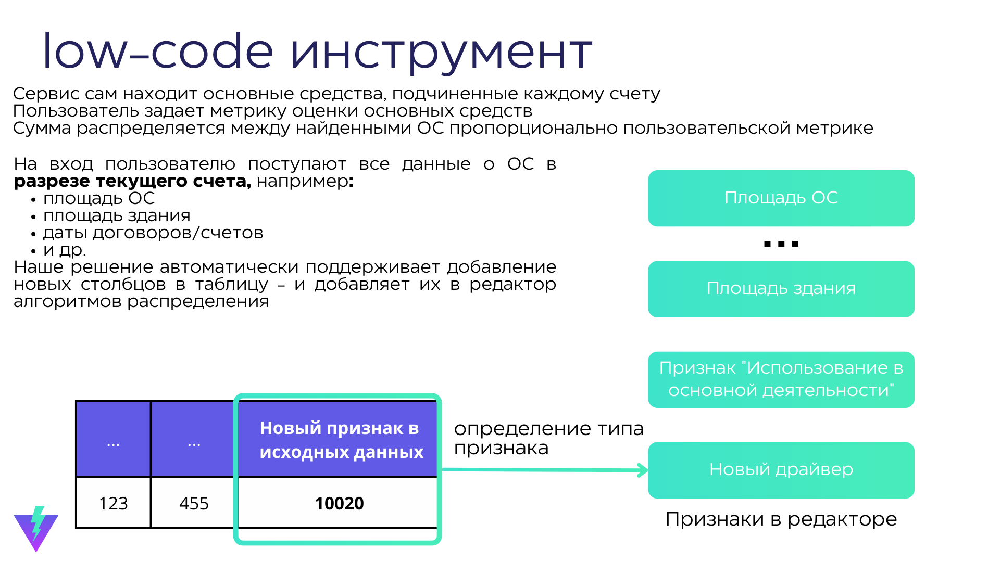
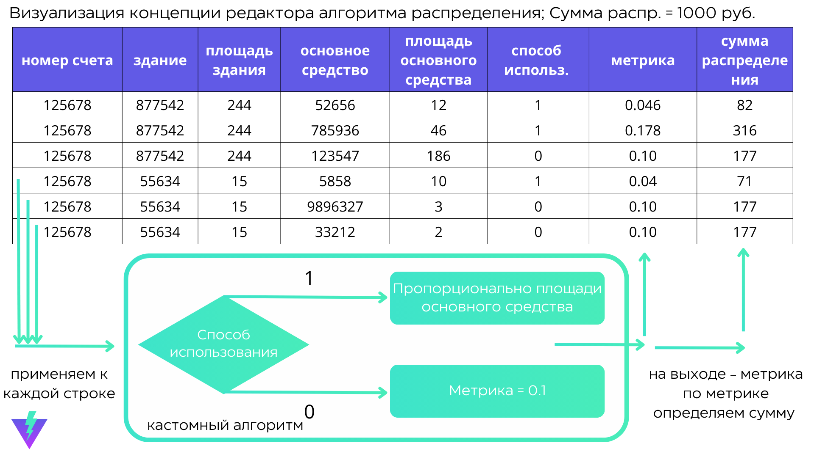

## Документация к модулю, реализующему алгоритм распределения по графу all_blocks

Основной концепт нашей low-code системы в создани графа для расчета произвольной метрики

---

### Документация по функциям и классам

Этот код представляет собой систему для редактирования и выполнения графов блоков, используемую для распределения значений на основе пользовательских алгоритмов. Основные классы и функции описаны ниже.

### Основные функции

#### `run_algo(row, dct_sums)`
Запускает алгоритм для строки данных, используя предоставленные суммы

- `row`: строка с данными в разрезе счет-договор-здание-ОС, см. пример пайплайна в main readme
- `dct_sums`: словарь сумм по признакам для некоторых блоков

----
#### `init_graph(raw_graph, features)`
Инициализирует граф блоков на основе сырых данных графа и признаков

- `raw_graph`: словарь с узлами и ребрами графа
- `features`: список признаков

----

#### `reset_graph()`
Сбрасывает состояние графа - нужно запускать перед каждым новым счетом для подготовки к новому обходу

----

#### `init_run()`
Инициализирует метрики и счетчики перед запуском алгоритма

---

#### `get_metric_after_run()`
Возвращает значение метрики после выполнения алгоритма - метрик насчитывается во время обходма, все блоки из любой части
графа влияют на метрику

---

#### `run_all_next_blocks(blocks_to_go, next_row, next_input=None)`
Запускает все следующие блоки для текущего блока.

- `blocks_to_go`: список следующих блоков
- `next_row`: следующая строка данных
- `next_input`: дополнительный вход (по умолчанию `None` - если от предыдущего блока не поступил контекст)

### Основные классы

#### `Block`
Класс от которого наследуются все блоки=вершины
Содержит в себе логику подсчета кол-во вызовов (защита от зацикливания), позволяет удобно расширять функционал в будущем

- `forward(row, input=None)`: основной метод для выполнения блока, **должен быть переопределн у любого блока**
- `main_forward(row, input=None)`: основной метод для выполнения блока с учетом ограничения количества вызовов.

-----
### Классы блоков реализу
Переопределяют метод forward
От предыдущих вершин к ним поступает какая-то строка входных данных + контекст, блок делает какое-то
действие меняя контекст, насчитывая итоговую метрику, но не меняя входные данные row.
Такой подход позволяет реализовывать обход графов любой сложности, быстро добавлять новые блоки.

- `Feature` - Блок для работы с признаками.
- `RootBlock` Корневой блок графа.
- `PlusMainMetric` Блок для увеличения основной метрики.
- `MinusMainMetric` Блок для уменьшения основной метрики.
- `MultMainMetric` Блок для умножения основной метрики.
- `SetEqualMainMetric` Блок для установки основной метрики в заданное значение.
- `AddFeatureDistribution` Блок для добавления значения признака к метрике с учетом коэффициента.
- `MulFeatureDistribution` Блок для умножения значения признака на метрику с учетом коэффициента.
- `IfBlockByValue` Условный блок для сравнения значения с порогом.
- `IfBlockByCat` Условный блок для проверки булевой переменной.
- `IfBlockByDatetime` Условный блок для проверки даты.

---
#### `get_block(block_dct, features)`
Возвращает объект блока на основе его типа и данных - конструктор объектов. Для добавления блока с новой функциональностью достаточно определить его класс - и добавить в эту функцию

------

### Пример использования
См. полный пайплайн, json файл с графом можете скачать на нашем сервисе:
[Полный пайплайн](https://github.com/talkiiing-team/zakupai/blob/main/services/api/ml/lib/pipeline_example.ipynb)

