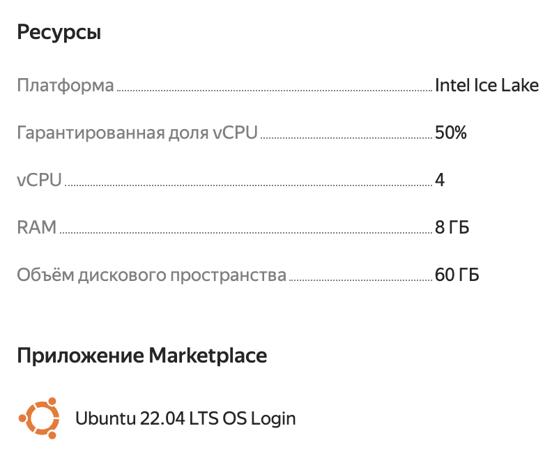

# Быстрый старт

Инструкция ориентирована на поднятие всего сервиса с нуля на удаленной машине.

> При желании можно использовать локальную машину, но мы не можем гарантировать работоспособность на окружении, отличном от указанного, при точном следовании инструкции.

### Оглавление

1. [Провизионинг инфраструктуры](#провизионинг-инфраструктуры)
2. [Провизионинг ПО](#провизионинг-по)
3. [Подготовка секретов](#провизионинг-по)
4. [Запуск сервисов](#запуск-сервисов)

## Провизионинг инфраструктуры

Нам потребуется одна виртуальная или физическая машина.
Рекомендуемые требования:

| Параметр  | Значение |
| --------- | -------- |
| CPU       | 400%     |
| RAM       | 8 Gb     |
| HDD / SSD | 60 Gb    |

Требуемая операционная система - **Ubuntu 22.04**.

Для демонстрационного стенда мы использовали сервис Compute Cloud у провайдера Yandex Cloud.



## Провизионинг ПО

Для провизионинга ПО нам потребуется локальная машина с \*Nix-подобной системой, утилиты `git` и `ansible-playbook`, и доступ с локальной машины по SSH-ключу до сервера.

Склонируем репозиторий на локальную машину:

```sh
git clone --depth 1 git@github.com:talkiiing-team/zakupai.git
```

Далее нам потребуется создать файл `inventory.cfg`, например, в корне репозитория с таким содержанием:

```
production ansible_host=адрес_хоста ansible_user=имя_пользователя
```

После выполнить команду:

```sh
ansible-playbook -i inventory.cfg playbooks/production.yaml
```

## Подготовка секретов

Для работы сервиса требуется создать файл .env с указанными значениями секретов для разных сервисов. Смотри документацию в .env.template.

## Запуск сервисов

Для упрощения мы будем использовать самую простую схему развертывания с клонированием Git-репозитория на удаленную машину.

Подключимся к удаленной машине по SSH.

Склонируем репозиторий в любую удобную директорию, например `/var/git/zakupai`:

```sh
mkdir -p /var/git

git clone --depth 1 git@github.com:talkiiing-team/zakupai.git /var/git/zakupai
```

Перейдем в директорию c репозиторием:

```sh
cd /var/git/zakupai
```

Создадим файл `.env`:

```sh
touch .env
```

В файл `.env` нужно положить содержимое ранее подготовленного `.env` с локальной машины любым удобным способом, например с помощью утилиты `scp` или с помощью текстовых редакторов `nano`, `vim` и т.п.

Для запуска сервисов нужно выполнить команду:

```sh
docker compose up -d --build
```
